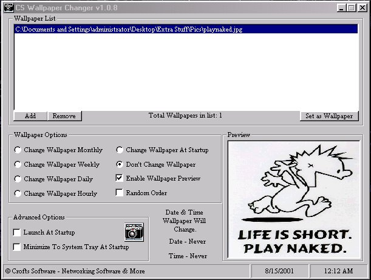



## CS Wallpaper Changer 1\.0\.9

### Description

This is a complete and finished program. This program has many features. It will save all your settings and remember which was the las picture load in the picture list. You can load jpg, bmp, and gif's. If a picture in the list is no longer there a pic of a error will appear in the preview. You can also have this run in the systray and launch at startup. See Pic for more details.
 
### More Info
 

             |
---                |---
**Submitted On**   |2001-08-15 00:27:02
**By**             |[Shane Croft](https://github.com/Planet-Source-Code/PSCIndex/blob/master/ByAuthor/shane-croft.md)
**Level**          |Intermediate
**User Rating**    |4.6 (32 globes from 7 users)
**Compatibility**  |VB 6\.0
**Category**       |[Complete Applications](https://github.com/Planet-Source-Code/PSCIndex/blob/master/ByCategory/complete-applications__1-27.md)
**World**          |[Visual Basic](https://github.com/Planet-Source-Code/PSCIndex/blob/master/ByWorld/visual-basic.md)
**Archive File**   |[CS Wallpap247048152001\.zip](https://github.com/Planet-Source-Code/shane-croft-cs-wallpaper-changer-1-0-9__1-26233/archive/master.zip)

